# CCTV Attendance Architecture (Pinecone-Powered)

```mermaid
flowchart TD
    A[CCTV Feed] --> B[Face Detection: RetinaFace]
    B --> C[Face Tracking: DeepSORT]
    C --> D[Face Recognition: ArcFace]
    D --> E[Vector Search: Pinecone Cloud]
    E --> F[Attendance Logic Engine]
    F --> G[MongoDB: Attendance Records]
    F --> H[Dashboard]

    subgraph Enrollment
        E1[Student Photos: front/left/right/far] --> E2[RetinaFace]
        E2 --> E3[ArcFace Embedding 512-dim]
        E3 --> E4[Average 4 Embeddings]
        E4 --> E5[⬆️ Push to Pinecone Cloud]
        E4 --> E6[💾 Store in MongoDB]
    end

    subgraph Attendance
        B1[RetinaFace detects face] --> B2[Compute ArcFace embedding]
        B2 --> B3[🔍 Query Pinecone]
        B3 --> B4[Get cosine similarity match]
        B4 --> B5{DeepSORT Tracking}
        B5 --> B6{3 frames + 3 sec + liveness OK?}
        B6 -->|YES| B7[✅ Mark Attendance]
        B6 -->|NO| B8[⏳ Keep tracking]
    end
```



## System Components

| Component | Technology | Purpose |
|-----------|-----------|---------|
| **Face Detection** | RetinaFace | Detect faces in CCTV stream (robust to angles, distances) |
| **Face Tracking** | DeepSORT | Track unique faces across frames (prevent re-recognition) |
| **Face Recognition** | ArcFace (DeepFace) | Generate 512-dim embeddings for face matching |
| **Vector Search** | Pinecone Cloud | Fast cosine similarity search for face identification |
| **Data Storage** | MongoDB | Student records, attendance logs, image metadata |
| **Image Storage** | Cloudinary CDN | Backup of student enrollment photos |

## Enrollment Flow

1. **User uploads 4 labeled photos** (frontend): front, left, right, far
2. **Backend detects face** in each photo (RetinaFace)
3. **Backend generates embedding** per photo (ArcFace) → 512 float32 vector
4. **Backend averages 4 embeddings** → single representative embedding
5. **Backend pushes to Pinecone Cloud** → vector indexed by roll_number
6. **Backend saves to MongoDB** → student metadata + embeddings + image URLs + Cloudinary IDs
7. **✅ Student fully enrolled** → searchable in Pinecone + persisted in DB

## Attendance Flow

1. **CCTV captures frame** at 1280×720, 30 FPS
2. **RetinaFace detects faces** in frame (upscaling for distant faces)
3. **For each detected face:**
   - Extract face region
   - Generate ArcFace embedding (512-dim)
    - **Query Pinecone** for best match (cosine similarity, top-1)
   - If similarity > threshold → recognized face
4. **DeepSORT tracks** each recognized face across frames
5. **For each tracked face:**
   - Check: visible >= 3.0 seconds?
   - Check: matched >= 3 frames?
   - Check: head moved >= 8px in last 3 sec (liveness)?
   - If all ✓ → **mark attendance in MongoDB**
6. **Dashboard updates** in real-time

## Configuration (Environment Variables)

### Pinecone Settings
```bash
PINECONE_ENABLED=1                        # Enable cloud search
PINECONE_API_KEY=pcsk_xxx...             # Your Pinecone API key
PINECONE_INDEX_NAME=face-recognition      # Index name (auto-created)
PINECONE_ENVIRONMENT=us-east-1-aws        # Pinecone region
```

### Detection Settings
```bash
FRAME_WIDTH=1280                          # Camera input width
FRAME_HEIGHT=720                          # Camera input height
SIMILARITY_THRESHOLD=0.45                 # Min cosine similarity to recognize
FACE_DET_UPSCALE=1.5                     # Upscaling for small/distant faces
FACE_DET_CONFIDENCE=0.5                   # Min confidence for detection
```

### Tracking Settings
```bash
TRACKING_ENABLED=1                        # Enable DeepSORT tracking
TRACK_MIN_SECONDS=3.0                     # Min visibility duration for mark
TRACK_MIN_HITS=3                         # Min matching frames for mark
TRACK_IOU_MATCH=0.3                     # IoU threshold for face-track matching
```

### Liveness Settings
```bash
LIVENESS_ENABLED=1                        # Enable movement check (anti-spoofing)
LIVENESS_WINDOW_SECONDS=3.0               # Time window for movement detection
LIVENESS_MIN_MOVEMENT_PX=8.0              # Min pixel movement required
```

## Performance Metrics

### Enrollment (4 photos)
- **Face detection:** 2-3s (2 detections × 1-1.5s each)
- **Embedding generation:** 3-4s (4 embeddings × 0.8-1s each)
- **Pinecone upload:** 1-2s (network + indexing)
- **Total:** 10-30s (acceptable for batch enrollment)

### Attendance
- **RetinaFace detection:** 0.5-1.5s per frame (30ms per face)
- **ArcFace embedding:** 0.8-1s (can be batched)
- **Pinecone query:** 5-50ms (cloud search)
- **Fallback local search:** <500ms for 100 students
- **DeepSORT tracking:** 1-2ms per update
- **Total per student:** 1-3s

### Scalability
- **Students:** 1000+ (Pinecone handles, no local memory constraint)
- **Queries/sec:** 100+ (Pinecone cloud infrastructure)
- **Index updates/sec:** 50+ (upsert during enrollment)

## Fallback & Reliability

If **Pinecone is unavailable**:
1. Enrollment still succeeds (MongoDB = primary storage)
2. Attendance uses **brute-force cosine similarity** on local embeddings
3. Performance degrades to <500ms per student (acceptable)
4. System continues without manual intervention

## Security & Privacy

- **Images:** Stored in Cloudinary (CDN + backups)
- **Embeddings:** Stored in Pinecone (encrypted in transit) + MongoDB (local backup)
- **Attendance records:** MongoDB (audit trail, timestamps)
- **API communication:** HTTP (can upgrade to HTTPS in production)

## Deployment Checklist

- [ ] Pinecone account created + API key obtained
- [ ] Environment variables set (backend + camera_service)
- [ ] Dependencies installed (`pip install -r requirements.txt`)
- [ ] MongoDB running and accessible
- [ ] Cloudinary configured (CLOUDINARY_CLOUD_NAME, etc.)
- [ ] Backend API started (`python backend/main.py`)
- [ ] Camera service started (`python camera_service/attendance_service.py`)
- [ ] 5-10 test students enrolled (4 photos each)
- [ ] Camera feed tested (verify face detection + Pinecone search)
- [ ] Attendance marks verified in MongoDB

## Troubleshooting

| Issue | Cause | Solution |
|-------|-------|----------|
| "❌ Pinecone connection failed" | API key invalid or network down | Verify API key + check Pinecone dashboard |
| "0% attendance marked" | TRACK_MIN_SECONDS too high | Reduce to 2.0 sec, test again |
| "Attendance slow (>5s)" | Pinecone latency | OK - falls back to <500ms local search |
| "False enrollment" | Low SIMILARITY_THRESHOLD | Increase to 0.50 or higher |
| "Face not detected" | Distant/partial face | Increase FACE_DET_UPSCALE to 2.0 |

````
